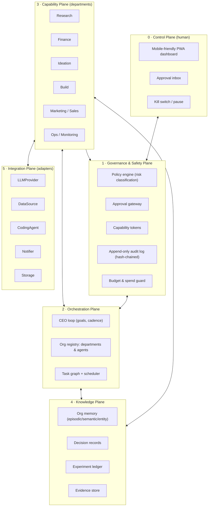

# Project Happy — AI Venture CEO System
## Development Plan

**Status:** Draft v0.1 (planning only — no application code yet)
**Owner:** guh829510-cmd
**Last updated:** 2026-08-20
**Branch:** `claude/ai-venture-ceo-system-jomsti`

---

## 0. Repository state at time of writing

The repository was inspected before this plan was written. It contained:

```
Project-Happy-/
├── .git/
└── README.md        (1 line: "# Project-Happy-")
```

- One commit (`395e551`, "Initial commit"), branches `main` and `claude/ai-venture-ceo-system-jomsti` (identical).
- No source code, no dependency manifests, no CI config, no license file, no vendored upstream code.

**Conclusion: this is a greenfield project.** Nothing is deleted or rewritten by this plan. This document is additive.

---

## 1. What we are building

An **AI-managed venture studio operating system**: a local-first control plane in which LLM-driven "departments" discover, validate, fund, build, market and monitor small ventures — under a human owner who holds all irreversible authority.

The system is best understood as **three things layered together**:

1. **A pipeline** — signals → opportunities → ideas → theses → experiments → ventures → metrics → learning.
2. **A governance shell** — every action is classified by risk, priced against a budget, and either auto-executed, escalated for approval, or hard-denied in code.
3. **An organizational memory** — durable, queryable, and the primary reason the system gets better over time rather than merely busier.

### 1.1 Design goals mapped to your 14 requirements

| # | Requirement | Delivered by | Milestone |
|---|---|---|---|
| 1 | Discover opportunities from signals | Signal Ingestion + Opportunity Miner | M3 |
| 2 | Research and validate | Research Department (DeepResearchAgent-style hierarchy) | M3 |
| 3 | Generate and rank ideas | Ideation + Scoring Rubric engine | M4 |
| 4 | Financial analysis / unit economics | Finance Department (FinRobot-style toolset) | M4 |
| 5 | Capital allocation decisions | Investment Committee + Decision Record | M5 |
| 6 | Create/manage departments & agents | Org Registry (Paperclip/Claw-Empire-style org chart) | M2 |
| 7 | Delegate to specialized agents | Task Graph + Agent Runtime adapter | M2 |
| 8 | Build products via coding agents | Build Department + CodingAgent adapter | M6 |
| 9 | Marketing and sales workflows | GTM Department (draft-only by default) | M6 |
| 10 | Monitor revenue/cost/profit/runway | Ledger + Metrics + Runway model | M5 |
| 11 | Learn from experiments and decisions | Experiment Ledger + Retrospective loop | M7 |
| 12 | Persistent organizational memory | Memory Plane (episodic/semantic/decision/entity) | M2 |
| 13 | Multiple ventures | Venture scoping on every entity from day one | M5 |
| 14 | Mobile dashboard + approvals | Control Plane PWA + Approval Gateway | M1 |

### 1.2 Non-goals for v1 (explicitly out of scope)

- Autonomous execution of money movement, contracts, borrowing, or securities issuance — **permanently out of scope**, not just v1 (see §8.1).
- Local GPU inference or self-hosted model serving.
- Multi-user / multi-tenant access control (single owner, single operator).
- Real-time streaming market data or trading of any kind.
- Kubernetes, microservices, message brokers, or any multi-node deployment.
- Browser/computer-use automation (see §7.4 on Open Computer Use).

---

## 2. Hard constraints and what they force

| Constraint | Architectural consequence |
|---|---|
| Low-spec computer | Single OS process. No Docker requirement, no Node build toolchain for the UI, no vector DB server, no Redis, no Postgres locally. Target: **< 400 MB RSS idle, < 1 GB peak**. |
| Near-zero infra budget | SQLite on disk; free-tier data sources; LLM spend is the only recurring cost and it is metered and capped. |
| Must run locally first | `pip install -e . && happy up` → one process, `http://localhost:8080`. No cloud account required to start. |
| No local GPU inference | All inference behind an `LLMProvider` port. Embeddings via API or a zero-cost lexical fallback. |
| Use LLM APIs where appropriate | Cheap models for routing/extraction, expensive models only for judgment steps; every call is priced and logged. |
| Must move to a cheap VPS without rewrites | **Ports-and-adapters everywhere**, no local filesystem assumptions outside a `Storage` port, SQLAlchemy so SQLite→Postgres is a config change, scheduler and job queue behind a `JobQueue` port. |
| Security + human approval built in | Governance is a **plane the orchestrator cannot bypass**, not a middleware the agent can be prompted around. |
| Never autonomously do irreversible financial/legal acts | Enforced by a code-level deny list at the tool boundary, plus capability tokens. Prompts are defence-in-depth, never the control. |

---

## 3. Architecture

### 3.1 Planes



**The single most important architectural rule:**
> Plane 3 (capabilities) can only reach Plane 5 (the outside world) *through* Plane 1 (governance). There is no direct call path. This is enforced structurally — the tool registry is the only holder of adapter handles, and it consults the policy engine on every invocation.

### 3.2 Why this shape

- **Governance as a plane, not a wrapper.** If approval logic lives inside an agent's prompt or a decorator an agent can choose, a sufficiently creative model routes around it. Making it the only path to I/O means bypassing it requires editing code, which is a reviewable, version-controlled act.
- **Ports and adapters (hexagonal).** Your explicit requirement that components be independently replaceable. Every external dependency is an interface with at least two implementations (one real, one fake) from day one — which also gives us testability for free (§11).
- **Event-sourced governance, CRUD everything else.** The audit log and decision records are append-only and hash-chained. Operational state (tasks, metrics) is ordinary mutable rows. Full event sourcing everywhere would be over-engineering for a low-spec single-user system.
- **Single process, many logical services.** Departments are Python modules behind a common interface, not separate deployables. On a VPS the same code runs with `WORKERS=2` and a Postgres URL; no rewrite.

### 3.3 Runtime topology

**Local (v1):**
```
┌─ happy (single Python process) ─────────────────┐
│  FastAPI (HTTP + SSE)  ← PWA dashboard          │
│  APScheduler (in-process cadence)               │
│  Worker loop (polls DB job table)               │
│  SQLite (WAL mode) + FTS5 [+ sqlite-vec opt.]   │
│  ./data/{happy.db, evidence/, artifacts/}       │
└─────────────────────────────────────────────────┘
        ↓ HTTPS only, egress-allowlisted
   LLM APIs · data sources · notification webhook
```

**VPS (v2, no rewrite):** same image, `DATABASE_URL=postgresql://…`, `JOB_QUEUE=postgres`, `STORAGE=s3`, systemd unit + Caddy TLS reverse proxy. Fits a 1 vCPU / 1 GB instance (~$5/mo).

### 3.4 Domain model

Every business entity is **venture-scoped from day one** (requirement 13) even though v1 runs one venture — retrofitting a tenant key later is exactly the "major rewrite" we were told to avoid.

| Entity | Purpose | Key fields |
|---|---|---|
| `Venture` | A product/business line | id, name, stage, status, budget_cap |
| `Signal` | Raw observation from the world | source, url, captured_at, raw_ref, hash |
| `Opportunity` | A clustered, framed problem worth money | thesis_text, market, confidence, evidence_ids |
| `Idea` | A candidate solution | opportunity_id, description, scores{} |
| `Thesis` | Falsifiable claim + kill criteria | claim, assumptions[], kill_criteria[] |
| `Experiment` | Cheapest test of a thesis | hypothesis, method, cost_cap, success_metric, result |
| `Decision` | An immutable choice + reasoning | type, options[], chosen, rationale, evidence_ids, reviewer |
| `Task` | Unit of delegated work | department, agent, inputs, status, parent_id, cost |
| `Department` / `AgentSpec` | Org chart | charter, tools[], model_tier, budget, capabilities[] |
| `LedgerEntry` | Money in/out (recorded, never moved) | venture_id, kind, amount, currency, source, occurred_at |
| `ApprovalRequest` | Human gate | action, risk_tier, payload, expires_at, state, decided_by |
| `MemoryRecord` | Organizational memory | kind, content, embedding?, tags, venture_id, ttl |
| `AuditEvent` | Hash-chained action record | actor, action, inputs_hash, outcome, prev_hash |

### 3.5 The CEO loop

The top-level agent is a **planner over the pipeline**, not a free-roaming autonomous agent. Each tick it:

1. Reads objectives, current portfolio state, budget remaining, runway.
2. Selects the highest-expected-value next move under a bounded action set.
3. Emits tasks into the task graph with explicit budgets and deadlines.
4. Collects results, updates the experiment ledger, writes a Decision record.
5. Escalates anything above its risk tier to the Approval Gateway and **blocks** on it.

Bounded action set (v1): `commission_research`, `score_ideas`, `run_financial_model`, `propose_experiment`, `allocate_budget`, `commission_build`, `draft_gtm_asset`, `request_approval`, `retire_venture`, `do_nothing`. Adding an action is a code change with a policy entry — never an emergent capability.

`do_nothing` is a first-class action. A system that must always act burns money proving it is busy.

---

## 4. Components

### 4.1 Control Plane — dashboard & approvals

- **Delivery:** server-rendered HTML (Jinja2) + HTMX + a PWA manifest and service worker. **Rationale:** a React/Vite build chain is the single heaviest thing we could put on a low-spec machine; HTMX gives a mobile-usable, installable app with zero build step and ~14 KB of JS.
- **Views:** Portfolio · Approvals (default landing on mobile) · Ventures · Experiments · Finance/runway · Agents · Memory search · Audit log · Spend.
- **Approvals UX:** one-tap approve/reject with a mandatory reason on reject; approvals expire (default 72 h) and expire **closed** (deny-by-default).
- **Push:** `Notifier` port — v1 ships console + email/webhook (ntfy.sh or Telegram bot, both free).

### 4.2 Governance & Safety Plane

- **Risk classifier** — deterministic rules first (action type, amount, reversibility, external visibility, data sensitivity), LLM only for *tie-breaking upward*. An LLM may raise a risk tier; it may never lower one.
- **Policy engine** — YAML policies, versioned in git, evaluated in code. Tiers:

| Tier | Meaning | Handling |
|---|---|---|
| **T0** | Read-only, internal, free/cheap | Auto-execute, logged |
| **T1** | Internal write, spends metered tokens | Auto within budget; logged |
| **T2** | External visibility or > cost threshold | **Human approval required** |
| **T3** | Irreversible, financial, legal, identity | **Human approval + typed confirmation + cooling-off period** |
| **T4** | Prohibited | **Hard-denied in code. No approval path exists.** |

- **Approval gateway** — the only bridge between planes 3 and 5 for T2+. Blocking, idempotent, replay-safe, with signed decision records.
- **Capability tokens** — each agent invocation receives a short-lived, scoped grant (`{venture, tools[], budget_remaining, expires_at}`). No ambient authority.
- **Audit log** — append-only, hash-chained (`prev_hash`), covering every tool call, LLM call, approval and decision. Tamper-evident, exportable.
- **Budget guard** — per-run, per-day, per-venture, per-department caps. A hard global daily cap halts the system rather than overspending.
- **Kill switch** — a single toggle that drains the queue and refuses new work; also reachable from mobile.

### 4.3 Orchestration Plane

- **Org registry** — departments and agents as declarative YAML specs (charter, allowed tools, model tier, budget, escalation path). Creating a department is data, not code (requirement 6).
- **Task graph** — DAG with dependencies, budgets, deadlines, retries, and a **depth limit** (default 3) to prevent recursive agent explosions.
- **Agent runtime adapter** — a port so the execution engine is swappable: v1 ships a small in-house loop; adapters can later target other frameworks without touching departments.
- **Scheduler** — APScheduler in-process; behind a `JobQueue` port so a VPS can move to a DB-backed or Redis worker.

### 4.4 Capability Plane — departments

| Department | Responsibilities | Notable constraints |
|---|---|---|
| **Research** | Signal ingestion, clustering, source-cited validation, competitor/market scans | Every claim carries an evidence reference; unsourced claims are rejected by a validator |
| **Ideation** | Idea generation, deduplication against memory, rubric scoring, ranking | Scores are structured (JSON schema) so they are comparable and auditable |
| **Finance** | Unit economics, CAC/LTV, cost models, scenario/sensitivity analysis, runway | **Analysis only.** Never connects to a payment rail or brokerage. Ledger is a record of what the human did. |
| **Investment Committee** | Stage-gate capital allocation with explicit kill criteria | Any real spend is a T3 recommendation to the human; the AI never disburses |
| **Build** | Specs, task decomposition, delegation to coding agents, review | Coding agents run in a sandboxed workspace; no push to protected branches; PRs only |
| **GTM (Marketing/Sales)** | Positioning, content drafts, outreach sequences, landing copy | **Draft-only by default.** Publishing/sending is T2. Bulk outreach is T3 and rate-limited. |
| **Ops** | Metrics collection, cost/revenue monitoring, runway alerts, anomaly detection | Read-mostly; alerting is its main output |
| **Retrospective** | Post-experiment analysis, updates priors, writes lessons to memory | Runs on a cadence, not on demand |

### 4.5 Knowledge Plane — organizational memory

Four memory kinds, deliberately distinct:

1. **Episodic** — what happened, when, at what cost (from the audit log).
2. **Semantic** — durable facts and lessons ("cold email in this niche converts < 0.5%").
3. **Decision** — why we chose what we chose, with the evidence available *at the time* (essential for honest retrospectives).
4. **Entity** — people, companies, competitors, channels, keywords.

**Retrieval strategy (cost-first):** SQLite **FTS5 lexical search is the default**; embeddings are an *optional enhancement*, not a dependency. Rationale: a BM25 index over a few thousand internal records is fast, free, deterministic, and testable; API embeddings add per-write cost, and local embedding models violate the no-GPU/low-spec constraint. `MemoryStore` is a port, so `sqlite-vec` or a hosted vector DB can be dropped in later without touching callers.

**Hygiene:** memories carry confidence and provenance; contradictions are surfaced rather than silently overwritten; a compaction job summarizes stale episodic detail.

### 4.6 Integration Plane — the ports

| Port | v1 adapter(s) | Later |
|---|---|---|
| `LLMProvider` | Anthropic; OpenAI-compatible; `FakeLLM` (tests) | Router with fallback, OpenRouter |
| `EmbeddingProvider` | `NullEmbedder` (lexical only) | API embeddings |
| `MemoryStore` | SQLite FTS5 | sqlite-vec, pgvector |
| `DataSource` | RSS/Atom, HTTP+HTML, public APIs, CSV import | Paid market/financial data |
| `CodingAgent` | Local subprocess in a sandboxed workspace | Hosted coding agents |
| `Notifier` | Console, webhook (ntfy/Telegram), SMTP | Push provider |
| `Storage` | Local filesystem | S3-compatible |
| `JobQueue` | SQLite-backed table + in-process worker | Postgres/Redis worker |
| `Ledger` | Manual entry + CSV import | Read-only accounting API (never write) |
| `Clock` / `Random` | Injected (deterministic tests) | — |

Every port ships with a **fake** implementation. Fakes are first-class production-quality code, not test scaffolding.

---

## 5. Dependencies

### 5.1 Runtime (deliberately small)

| Package | Purpose | License |
|---|---|---|
| Python ≥ 3.11 | Runtime | PSF |
| `fastapi` + `uvicorn` | HTTP/SSE server | MIT / BSD-3 |
| `pydantic` v2 | Schemas, validated LLM output | MIT |
| `sqlalchemy` ≥ 2 + `alembic` | ORM + migrations (SQLite→Postgres portability) | MIT |
| `jinja2` | Server-rendered templates | BSD-3 |
| `httpx` | HTTP client with timeouts | BSD-3 |
| `apscheduler` | Cadence scheduling | MIT |
| `pyyaml` | Policy/org specs | MIT |
| `structlog` | Structured JSON logging | MIT/Apache-2.0 |
| `typer` | CLI (`happy up`, `happy tick`, `happy audit`) | MIT |
| `tenacity` | Retry/backoff | Apache-2.0 |
| `anthropic` / `openai` | LLM SDKs (either or both, optional extras) | MIT / Apache-2.0 |

**Frontend:** HTMX (BSD-2) and Pico.css or hand-written CSS — both vendored as static files. **No npm, no bundler, no build step.**

**Optional extras (never required to boot):** `feedparser` (RSS), `selectolax`/`beautifulsoup4` (HTML extraction), `sqlite-vec` (vector search), `yfinance`/`finnhub-python` (market data — see §7.5).

### 5.2 Development

`pytest`, `pytest-asyncio`, `pytest-cov`, `hypothesis` (property tests), `ruff` (lint+format), `mypy` (strict on core/ and governance/), `pip-audit` or `uv pip audit` (CVEs), `reuse` or `pip-licenses` (license compliance in CI).

### 5.3 Excluded on purpose

Docker (optional convenience only) · Redis · Celery · Kafka · Postgres locally · Chroma/Qdrant/Weaviate servers · LangChain/LlamaIndex as a *core* dependency (heavy transitive trees, high churn; may appear behind an adapter if it earns its place) · any local model-serving stack.

---

## 6. Milestones

Each milestone ends with something runnable and demonstrable. Estimates assume part-time solo work.

| # | Milestone | Exit criteria | Est. |
|---|---|---|---|
| **M0** | **Foundation** | Repo scaffold, `pyproject.toml`, config via env + `.env`, SQLite + Alembic, structured logging, `happy` CLI, CI (lint/type/test), LICENSE + NOTICE, ADR directory. `happy up` serves a health page. | 3–5 d |
| **M1** | **Governance first** | Policy engine, risk tiers, T4 hard-deny list, approval gateway, capability tokens, hash-chained audit log, budget guard, kill switch, mobile PWA with a working approvals inbox. **A fake "dangerous" tool is provably blocked end-to-end.** | 1–1.5 wk |
| **M2** | **Orchestration & memory** | `LLMProvider` port + 2 adapters + fake, cost metering, org registry from YAML, task graph with depth/budget limits, memory plane with FTS5 search and a UI. One trivial department runs a real delegated task under budget. | 1.5–2 wk |
| **M3** | **Discovery & research** | Signal ingestion (RSS/HTTP/CSV), dedup, clustering into opportunities, research agent producing **source-cited** validation reports, evidence store, dashboard views. | 2 wk |
| **M4** | **Ideation & finance** | Idea generation + rubric scoring + ranking; unit-economics engine (CAC/LTV/margin/breakeven), scenario + sensitivity analysis, assumption registry with provenance. | 2 wk |
| **M5** | **Portfolio & capital** | Investment committee stage gates, decision records, ledger, runway model, cost/revenue monitoring, multi-venture views. **All disbursement is a T3 recommendation.** | 1.5–2 wk |
| **M6** | **Build & GTM** | `CodingAgent` adapter with sandboxed workspace + PR-only output; build department (spec→tasks→review); GTM drafting with publish gated at T2. | 2–3 wk |
| **M7** | **Learning loop** | Experiment ledger with kill criteria, retrospective agent, prior updating, lesson memory, "what did we learn / what did it cost" report. | 1.5 wk |
| **M8** | **Portability & hardening** | Postgres adapter proven, S3 storage adapter, systemd + Caddy deploy guide, backup/restore + audit-chain verification, secret rotation, load/cost soak test, threat-model review. | 1.5 wk |

**Sequencing rationale:** governance ships in **M1, before any agent exists**. Building capabilities first and adding safety later is how these systems end up with a bypassable gate — the gate must predate the thing it gates.

**Decision checkpoints:** after M3 (is discovery producing anything a human judges non-obvious?), after M5 (is cost-per-decision sustainable?), after M7 (is the learning loop measurably improving rankings, or just generating prose?). Each checkpoint is a legitimate stop-or-pivot point.

---

## 7. Licensing considerations

### 7.1 Verified upstream licenses

Checked directly against each repository (2026-08-20):

| Project | License | Verified |
|---|---|---|
| **Paperclip** (`paperclipai/paperclip`) | **MIT** | Yes |
| **Claw-Empire** (`GreenSheep01201/claw-empire`) | **Apache-2.0** | Yes |
| **FinRobot** (`AI4Finance-Foundation/FinRobot`) | **Apache-2.0** | Yes |
| **DeepResearchAgent** (`SkyworkAI/DeepResearchAgent`) | **MIT** | Yes |
| **Open Computer Use** (`Wide-Moat/open-computer-use`) | **FSL-1.1-Apache-2.0** | Yes — **excluded**, see §7.4 |

All four permitted upstreams are permissive and mutually compatible. None is copyleft. None requires us to open-source our own work (though we intend to).

### 7.2 Our posture: concepts in, code mostly out

Per your instruction not to copy blindly, the default is **learn from the design, write our own implementation**:

| Upstream | What we take | What we do *not* take |
|---|---|---|
| Paperclip | Org-chart-as-data, budgets/cost controls, heartbeat cadence, goal alignment, isolated companies | Its Node/React/Postgres stack (wrong fit for a low-spec Python system) |
| Claw-Empire | Department model, agent roles/levelling, meeting/handoff patterns, local-first storage | Pixel-art UI, PixiJS, its CLI-agent orchestration layer |
| FinRobot | Financial chain-of-thought decomposition, agent/tool separation for finance, report structure | Its AutoGen dependency; its data-provider coupling (see §7.5) |
| DeepResearchAgent | Hierarchical planner→specialist decomposition, memory design, self-improvement loop | Its browser/computer-use environments; its full tool surface |

**If we ever do vendor code**, the rules are non-negotiable:
1. Vendor into `third_party/<project>/` — never scattered into our modules.
2. Preserve the upstream `LICENSE` and copyright headers verbatim.
3. Record it in `NOTICE` and `THIRD_PARTY_LICENSES.md` with commit SHA, date, and modifications.
4. Apache-2.0 code additionally requires stating changes made (ALv2 §4(b)).
5. Open a dedicated PR titled `vendor:` so the decision is separately reviewable.

### 7.3 Our own license

**Recommendation: Apache-2.0** for Project Happy. It is compatible with everything above, and its explicit patent grant matters more than MIT's brevity for a project touching financial analysis. Alternative if you prefer maximum simplicity: MIT. **This must be chosen and committed in M0** — an unlicensed public repo is "all rights reserved" and effectively unusable by anyone, including future you.

### 7.4 Why Open Computer Use is excluded

Confirmed **FSL-1.1-Apache-2.0** (Functional Source License → converts to Apache-2.0 after two years). Two independent reasons to exclude it now:

1. **The Competing Use restriction.** FSL forbids use that competes with the licensor. Since Project Happy is explicitly intended to *build and operate commercial ventures*, whether a future venture "competes" is a judgement we cannot make reliably in advance. That is an unbounded legal exposure for a bounded technical benefit.
2. **Transitive licensing.** Its distribution pulls dependencies with their own additional restrictions, so the effective license of the whole is more restrictive than the headline.

Consequence: **no computer-use / GUI automation in v1.** If browser automation is later required, it is added as a clean-room `BrowserAgent` port implemented over permissively licensed tooling (e.g. Playwright, Apache-2.0), reviewed for its own risks. This does not block anything on the critical path.

### 7.5 Data-source licensing — the trap that actually bites

Library licenses are the easy part. **The terms of service on the data are the real constraint**, and they differ from the library's license:

- `yfinance` is Apache-2.0, but it scrapes Yahoo Finance, whose ToS restricts commercial use and redistribution. Fine for private exploration; **not** for a product feature.
- Finnhub / FMP / SEC-API free tiers carry rate limits and redistribution limits; SEC EDGAR requires a declared User-Agent and enforces fair-access rate limits.
- Scraped web content used as "signals" may be copyrighted; robots.txt and rate limits must be respected.

**Mitigations, in the architecture rather than in a policy document:**
- Every `DataSource` adapter declares machine-readable metadata: `license`, `commercial_use`, `redistribute`, `rate_limit`, `attribution_required`.
- The evidence store records provenance and terms per record.
- The policy engine **blocks** publishing or redistributing any artifact derived from a source flagged `redistribute: false`. This makes a licensing mistake a runtime failure rather than a lawsuit.
- Prefer sources that are unambiguously safe: SEC EDGAR, public RSS, government/open-data portals, first-party data from our own ventures.

### 7.6 Model provider terms

Provider ToS govern outputs and usage (commercial use, prohibited categories, data retention, whether inputs train models). Record the assumed terms per provider in `docs/providers/`, and re-check at M8 and before any public launch. Never send credentials, personal data, or third-party confidential material into a prompt.

---

## 8. Security considerations

### 8.1 The prohibitions — implemented as code, not as prompt text

Your absolute constraints become a **T4 deny list evaluated at the tool boundary**, with no approval path:

- Initiating or authorizing any transfer of money, payment, payout, or refund.
- Signing, accepting, or agreeing to any contract, ToS, or legally binding commitment.
- Borrowing, applying for credit, or incurring debt.
- Issuing, offering, or transacting in securities or tokens.
- Filing legal, tax, or regulatory documents.
- Creating legal entities or acting as a company representative.
- Any action against a payment processor, bank, brokerage, or exchange API.
- Any irreversible destructive action (deleting production data, force-pushing shared history).

Enforcement is layered so that no single failure is sufficient:

1. **No credentials exist.** Payment/banking/brokerage credentials are never present in the environment the agent runs in. This is the strongest control — you cannot misuse what you do not hold.
2. **Egress allowlist.** Outbound HTTP is restricted to an explicit domain allowlist; financial rails are not on it. Denied egress is logged as a security event.
3. **Tool-boundary deny list.** T4 actions raise `ProhibitedAction` and are logged; the approval gateway has no code path to approve T4.
4. **Prompt-level instruction.** Present, but treated as the weakest layer and never relied upon.

**Design note:** the Finance department produces *analysis and recommendations*. The ledger *records* money movements the human performed. The system is deliberately built with no ability to move value.

### 8.2 Threat model (abbreviated STRIDE)

| Threat | Vector | Mitigation |
|---|---|---|
| **Prompt injection** | Malicious content in a scraped page, RSS item, competitor site, or an issue/PR the coding agent reads | Treat all fetched content as untrusted data, never instructions; strict content/instruction separation; structured (schema-validated) outputs only; tools are allowlisted per agent; injected content cannot raise a capability token's scope; T2+ still needs a human |
| **Excessive agency** | Agent chains its way to an unintended action | Bounded action set, capability tokens, task depth limit, budget caps, deny list |
| **Credential theft** | Keys in prompts, logs, or the DB | Secrets from env/OS keyring only; never in DB or git; automatic redaction in logs and audit records; `.env` gitignored; pre-commit secret scanning |
| **Cost/DoS** | Runaway loops, recursive spawning, expensive model on cheap tasks | Per-run/day/venture caps, hard global kill, depth limits, model tiering, loop detection |
| **Data exfiltration** | Agent posts internal data externally | Egress allowlist; publish actions are T2; outbound payloads are logged and reviewable |
| **Supply chain** | Malicious/typosquatted dependency | Pinned versions + hashes, lockfile, `pip-audit` in CI, minimal dependency set, no pipe-to-shell installers |
| **Tampering** | Falsified history to hide a bad decision | Hash-chained audit log with a `verify` command; append-only tables |
| **Coding-agent escape** | Generated code runs with full privileges | Sandboxed workspace dir, no network by default, no repo secrets mounted, PR-only output, never auto-merge, human review required |
| **Repudiation** | "The AI did it" with no record | Every action carries actor, capability token, inputs hash, cost, and outcome |
| **Local exposure** | Dashboard reachable on the LAN | Bind `127.0.0.1` by default; on VPS require TLS + auth; session cookies `HttpOnly`/`Secure`/`SameSite=Strict` |

### 8.3 Approval design principles

- **Deny by default.** Unknown action type → highest applicable tier, never auto-execute.
- **Fail closed.** Governance component unavailable → the system stops. It never degrades into "proceed unchecked".
- **Expiry closes.** An unanswered approval expires as *denied*.
- **Informed consent.** Every request shows: what will happen, what it costs, what is irreversible about it, what evidence supports it, and what happens if you decline.
- **No batching of T3.** Bulk-approving irreversible actions defeats the purpose.
- **Cooling-off on T3.** A minimum delay between request and executable approval, to defeat momentary rubber-stamping.
- **Approval fatigue is a security risk.** If the system asks 50 times a day you will approve blindly. Tune tiers so routine work is T0/T1 and human attention is spent where it matters — and measure the approval rate as a health metric.

### 8.4 Operational security

Secrets via environment/keyring; single-user auth on the dashboard (password + optional TOTP) with rate-limited login; DB file permissions `0600`; nightly encrypted backup of `happy.db` + evidence with a tested restore path; dependency and CVE scanning in CI; `SECURITY.md` with a disclosure contact.

---

## 9. Documented assumptions

Per your instruction, no major architectural assumption goes undocumented. Each has an ID, a rationale, and — importantly — **what we do if it turns out to be wrong**.

| ID | Assumption | If wrong |
|---|---|---|
| **A1** | Python is the right core language | Financial/research ecosystems are Python; upstreams we lean on most (FinRobot, DeepResearchAgent) are Python. If TS is preferred, the plane/port design transfers unchanged; only implementations change. |
| **A2** | SQLite suffices for v1 | Single-user, low write volume. If concurrency becomes a problem, SQLAlchemy makes Postgres a config change. |
| **A3** | Server-rendered HTMX beats a JS SPA here | No build step, low memory, mobile-friendly. If richer interactivity is needed, add a compiled SPA at M8 against the same JSON API. |
| **A4** | Lexical search is enough for memory v1 | Corpus is small; embeddings cost money per write. `MemoryStore` port makes vectors a drop-in later. |
| **A5** | One process is enough | Low request volume. `JobQueue` port allows splitting web/worker with no rewrite. |
| **A6** | LLM APIs are affordable at target volume | Assumes ~$20–60/mo at a few dozen decisions/day with tiered models. **Must be validated with real cost telemetry by end of M2** — if 5–10× off, reduce cadence and increase batching. |
| **A7** | The owner is available to approve within ~72 h | Drives expiry defaults. If unavailable for longer, the system idles safely rather than proceeding. |
| **A8** | v1 runs a single venture; the schema is multi-venture | Multi-venture is a data concern, not a rewrite, precisely because we scope entities now. |
| **A9** | Coding agents produce PRs, never direct commits to protected branches | Keeps a human in the loop on all generated code. Non-negotiable. |
| **A10** | The human is the sole legal and financial actor | The system is built with no capability to move value. Any change here is a re-architecture requiring explicit review, not a feature toggle. |
| **A11** | Discovery quality is the biggest open risk | Unproven that LLM-driven discovery finds non-obvious opportunities. M3 checkpoint exists specifically to test this before further investment. |

Assumptions become ADRs in `docs/adr/` (`NNNN-title.md`) as they are confirmed or overturned.

---

## 10. Risks

### 10.1 Product / value risks — the ones most likely to actually kill this

| Risk | Sev | Mitigation |
|---|---|---|
| **The system generates plausible but worthless opportunities.** The core unproven premise. | **High** | M3 checkpoint with an explicit human quality judgement; require source-cited evidence; measure precision of surfaced opportunities against your own assessment; be willing to stop. |
| **Sophistication theatre** — an impressive org chart that produces nothing shippable | **High** | Every milestone must produce a demonstrable artifact; track "decisions that changed what the human did", not activity volume. |
| **The learning loop generates prose, not improvement** | Medium | Retrospectives must update *structured* priors (rubric weights, kill criteria), and improvement must be measurable, or M7 is judged failed. |
| **Scope explosion** — 14 requirements is a lot for a solo part-time build | **High** | Strict milestone gating; M1 governance and M3 discovery are the only things that must be excellent early. |

### 10.2 Technical risks

| Risk | Sev | Mitigation |
|---|---|---|
| LLM cost overruns | High | Hard caps at every level, model tiering, caching, batching, telemetry from M2 |
| Low-spec machine can't cope | Medium | Single process, no vector DB, no bundler; memory ceiling as an explicit NFR with a soak test at M8 |
| Provider API changes/deprecations | Medium | `LLMProvider` port + contract tests; two adapters from day one |
| Non-determinism makes debugging hard | Medium | Full prompt/response capture, seeds and `Clock` injection, replay harness |
| Structured-output drift | Medium | Pydantic validation on every LLM boundary with repair-retry then fail; never trust free text |
| Local↔VPS drift | Medium | Same code path both ways; Postgres adapter tested in CI from M8 |

### 10.3 Financial, legal, and operational risks

| Risk | Sev | Mitigation |
|---|---|---|
| **AI-driven decision causes real financial loss** | **High** | AI never disburses; T3 human approval with cooling-off; per-venture caps; kill criteria defined *before* an experiment starts |
| Data-source ToS violation in a commercial context | Medium | Source metadata + policy-engine blocking of redistribution (§7.5) |
| Regulatory exposure from marketing claims | Medium | GTM output is draft-only; human review before publication; no claims without evidence references |
| Undisclosed AI-generated outreach | Medium | Disclosure required in outbound comms; anti-spam limits; respect opt-outs |
| Upstream license change | Low | Concept-level borrowing, not code; vendored code pinned to a reviewed SHA |
| Owner burnout / approval fatigue | Medium | Tune tiers, batch T1, weekly digest rather than per-event pings |
| Single point of failure (one operator) | Medium | Everything in git; backups tested; a runbook so the system can be paused cleanly and left idle |

---

## 11. Testing strategy

### 11.1 Layers

| Layer | Scope | Tooling | Gate |
|---|---|---|---|
| **Unit** | Pure logic: scoring, unit economics, risk classification, runway math | `pytest`, `hypothesis` | ≥ 85% on `core/`, `governance/`, `finance/` |
| **Contract** | One shared suite run against **every** adapter for a port, real and fake | parametrized `pytest` | Every port has ≥ 2 passing adapters |
| **Policy / security** | **Must-fail tests**: the suite actively attempts prohibited actions and asserts they are denied and audited | `pytest` | 100% of T4 list covered; **any failure blocks merge** |
| **LLM evaluation** | Golden fixtures for extraction/classification/scoring; recorded responses replayed | `pytest` + cassettes | No regression vs. baseline |
| **Simulation** | Full pipeline on a synthetic world with `FakeLLM`, fake sources, injected clock — deterministic, offline, free | `pytest` | Full run < 60 s, zero network, zero cost |
| **Integration** | Real DB, real HTTP server, fake externals | `pytest` + `httpx` test client | Green |
| **E2E smoke** | `happy up` → ingest → research → idea → approval → decision, through the UI | Playwright (optional, dev only) | Green before each milestone tag |
| **Cost regression** | Assert token/cost per pipeline run stays within budget | custom metering assertions | Fails if > 20% over baseline |
| **Migration** | Alembic up/down on a seeded DB; SQLite **and** Postgres | `pytest` | Green from M8 |
| **Chaos (light)** | Provider timeouts, malformed JSON, rate limits, DB lock, mid-task kill | fault-injecting fakes | System degrades safely, never proceeds unchecked |

### 11.2 Principles

- **No test hits a paid API or the public internet by default.** Network access in tests is blocked at the fixture level; live-API tests are opt-in via `-m live` and run manually.
- **The simulation harness is the workhorse.** A deterministic synthetic venture world lets us test the whole pipeline — including "the market rejected the idea" and "the experiment failed" paths — for free, repeatedly.
- **Security tests are adversarial by construction.** Including prompt-injection fixtures: hostile text embedded in fetched documents that attempts to escalate capability or trigger a T4 action. The assertion is always *denied and audited*.
- **Fakes are production-grade.** A weak fake gives false confidence; contract tests keep fakes honest against real adapters.
- **Determinism by injection.** `Clock`, `Random`, and `LLMProvider` are always injected. No `datetime.now()` in domain code.

### 11.3 CI (GitHub Actions, free tier)

On every PR: `ruff` → `mypy` → unit + contract + policy → simulation → migrations → `pip-audit` → license check. Target < 5 min. On `main`: additionally the Postgres matrix and a nightly cost-regression run.

**Merge blockers:** any policy/security test failure; coverage drop on `governance/`; a new dependency without a license entry; a secret detected.

---

## 12. Repository layout (proposed for M0)

```
Project-Happy-/
├── DEVELOPMENT_PLAN.md
├── LICENSE  NOTICE  THIRD_PARTY_LICENSES.md  SECURITY.md  README.md
├── pyproject.toml
├── docs/
│   ├── adr/                  # architecture decision records
│   ├── policies/             # risk tiers, deny list, budgets (YAML, versioned)
│   ├── org/                  # department & agent specs (YAML)
│   ├── providers/            # provider ToS notes
│   └── runbook.md
├── src/happy/
│   ├── core/                 # domain models, ports, errors, clock
│   ├── governance/           # policy engine, gateway, capabilities, audit, budget
│   ├── orchestration/        # CEO loop, org registry, task graph, scheduler
│   ├── departments/          # research, ideation, finance, build, gtm, ops, retro
│   ├── memory/               # stores, retrieval, compaction
│   ├── adapters/             # llm/, data/, coding/, notify/, storage/, queue/
│   ├── web/                  # FastAPI app, templates/, static/
│   └── cli.py
├── tests/{unit,contract,policy,simulation,integration,fixtures}/
├── migrations/
└── data/                     # gitignored: happy.db, evidence/, artifacts/
```

---

## 13. Immediate next steps

1. **Review this plan** and flag anything you disagree with — especially §7.3 (our license), A1 (Python), A3 (HTMX vs SPA), and A6 (cost assumption).
2. **Choose the license** so M0 can commit it.
3. **Confirm the milestone order** — in particular that governance (M1) lands before any agent capability.
4. On approval, begin **M0**: scaffold, config, DB, CI, license files, ADR 0001 recording the plane architecture.

Nothing in this document has been implemented. No existing files were modified or deleted.
