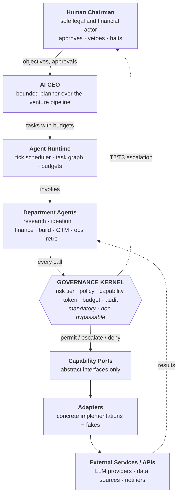

# Architecture v2 — Clean-Room, Local-First

**Status:** Authoritative architecture. Supersedes `DEVELOPMENT_PLAN.md` §3 (the six-plane sketch), which it refines into the eight-module structure below. All other sections of `DEVELOPMENT_PLAN.md` remain in force.
**Date:** 2026-08-20
**Driver:** [`docs/research/UPSTREAM_AUDIT.md`](../research/UPSTREAM_AUDIT.md) · [`legal/THIRD_PARTY_LICENSE_MATRIX.md`](../../legal/THIRD_PARTY_LICENSE_MATRIX.md)

---

## 0. The governing principle

> **Integrate nothing from Paperclip, Claw-Empire, FinRobot or DeepResearchAgent.**
> We build our own implementation, informed by their concepts. No upstream source code enters this repository.

This is not caution for its own sake. It is the direct consequence of six findings, each re-verified against the cloned repositories before this document was written:

| # | Finding | Re-verified evidence | Consequence |
|---|---|---|---|
| 1 | FinRobot has GPL-3.0 in its import graph | `finrobot/functional/quantitative.py:5` → `import backtrader as bt`; PyPI `backtrader` → `GPLv3+` | No FinRobot vendoring, no module imports, no source copying, **`backtrader` is permanently denylisted** |
| 2 | FinRobot licensing is self-contradictory | `setup.py:18` `license="MIT"` + MIT classifier vs Apache-2.0 `LICENSE` and `NOTICE` | FinRobot = `UNKNOWN — REQUIRES REVIEW`. No code integration |
| 3 | Claw-Empire carries a commercial runtime gate | `package.json` `remotion@^4.0.429`, `@remotion/cli@^4.0.429` as **dependencies**; `prestart` → `ensure-remotion-runtime.mjs` | No Claw-Empire integration or vendoring |
| 4 | DeepResearchAgent HEAD ships order execution | HEAD `src/agent/` contains `online_/offline_/intraday_/interday_trading_agent.py`; **v1.0.0 contains zero** | HEAD excluded. **v1.0.0 (`4acd4c7`) is an architectural reference to read, not code to copy.** Our system contains no autonomous trading or order-execution capability, ever |
| 5 | DeepResearchAgent vendors LightRAG without license metadata | `src/tool/esg_tools/lightrag/LICENSE` → does not exist | No DRA vendoring, no LightRAG vendoring |
| 6 | Paperclip mandates PostgreSQL | `.env.example:1` `DATABASE_URL=postgres://…`; `embedded-postgres@^18.1.0-beta.16` | Unsuitable for a low-spec local-first target, independent of licensing |

**Everything below is original design.** Where an upstream idea informed a decision, it is cited as prior art in prose — never as code, never as a dependency.

---

## 1. The command chain

The system is a chain of authority. Each link may only command the link below it, and only through the interface that link publishes.



### 1.1 Where governance sits — a decision, stated rather than assumed

The target chain given in the brief runs *Department Agents → Capability Ports → External Services* and does not name governance. **We place the governance kernel between Department Agents and Capability Ports, as a mandatory interceptor**, for one reason:

> A gate that a caller can choose to use is not a gate.

Concretely, the enforcement is **structural, not procedural**:

- Department agents are constructed with **port interfaces only** — abstract types with no implementation attached.
- The composition root binds each port interface to a `GovernedPort` proxy that wraps the real adapter.
- **The dependency container never hands a raw adapter to a department.** There is no reference to obtain, so there is no path to bypass.
- Bypassing therefore requires editing the composition root — a reviewable, version-controlled, test-guarded act, not an emergent runtime behaviour.

This is the single most important structural decision in the system. It is recorded as **ADR-0002**.

### 1.2 Authority at each link

| Link | May decide | May never decide |
|---|---|---|
| **Human Chairman** | Everything. Objectives, capital, approvals, kill | — |
| **AI CEO** | Which bounded action to take next, within budget and risk tier | Anything T2+; anything outside its bounded action set |
| **Agent Runtime** | Ordering, concurrency, retries, budget enforcement | What the work *means*; it never interprets business content |
| **Department Agents** | How to perform their charter using granted tools | Which tools exist; their own budget; their own risk tier |
| **Governance Kernel** | Permit / escalate / deny; it may raise a risk tier | It may **never lower** a risk tier, and has no code path to permit T4 |
| **Capability Ports** | Nothing — they are contracts | — |
| **Adapters** | How to satisfy a contract against one vendor | Whether the call is allowed |

---

## 2. The eight modules

Dependencies point **inward only**. An arrow means "may import from".

```
        ui ─────────┐
                    ▼
  governance ──► core ◄── persistence
        ▲           ▲
        │           │
     runtime ───────┘
        │
        ▼
      ports ◄── adapters ──► integrations
```

`core` imports nothing from the other seven. That is what makes the domain testable without a database, a network, or an LLM.

| # | Module | Package | Owns | May import | May **NOT** import |
|---|---|---|---|---|---|
| 1 | **Domain / core** | `happy.core` | Entities, value objects, business rules, risk taxonomy, pipeline state machine, errors, `Clock`/`Random` protocols | stdlib, `pydantic` | everything else |
| 2 | **Agent runtime** | `happy.runtime` | Tick scheduler, task graph, delegation, budget accounting, retry, depth limits, agent loop | `core`, `ports`, `governance` | `adapters`, `integrations`, `ui` |
| 3 | **Capability ports** | `happy.core.ports` | Abstract interfaces **only**, plus their typed IO schemas and capability declarations | `core` | everything else |
| 4 | **Adapters** | `happy.adapters` | Concrete port implementations, one per vendor, **plus a fake per port** | `core`, `ports`, `integrations` | `runtime`, `governance`, `ui` |
| 5 | **Governance** | `happy.governance` | Risk classifier, policy engine, T4 deny list, approval gateway, capability tokens, budget guard, hash-chained audit, kill switch, `GovernedPort` proxy | `core`, `ports` | `adapters`, `integrations`, `runtime`, `ui` |
| 6 | **Persistence** | `happy.persistence` | SQLAlchemy models, repositories, Alembic migrations, FTS5 index, unit of work | `core` | `runtime`, `adapters`, `ui`, `governance` |
| 7 | **UI** | `happy.ui` | FastAPI app, Jinja2 templates, HTMX partials, SSE, PWA shell, approval inbox | `core`, `runtime`, `governance`, `persistence` | `adapters`, `integrations` |
| 8 | **External integrations** | `happy.integrations` | Vendor SDK wrappers, credential resolution, rate limiting, retry/backoff, **per-source licensing and ToS metadata** | `core` | `runtime`, `governance`, `ui`, `adapters` |

### 2.0 Where the ports live

Modules 1 and 3 are one package on disk: ports live at **`src/happy/core/ports/`**,
not at `happy.ports`. A port is an abstract contract expressed entirely in
domain types and depends on nothing else in the system, so nesting it inside
`core` removes a package boundary that carried no rule with it. The eight-module
layering is unchanged — `adapters` still depends on `ports`, and `core` still
imports nothing outward.

### 2.1 Adapters vs. external integrations — the least obvious split

These two are commonly conflated. The distinction is load-bearing here:

- **An integration is about a vendor.** It knows the base URL, the auth scheme, the rate limit, the pricing, the ToS, and the `redistribute` flag. It knows nothing about Project Happy's domain.
- **An adapter is about a contract.** It translates between a port interface and one integration. It knows nothing about HTTP.

Why bother: swapping Anthropic for an OpenAI-compatible endpoint touches one integration. Changing what `LLMProvider` *means* touches one port and its adapters. Neither ever reaches `core`. And **licensing metadata lives in exactly one place** (`integrations`), which is what lets the policy engine mechanically block redistribution of restricted data — the enforcement promised in `DEVELOPMENT_PLAN.md` §7.5.

### 2.2 Repository layout

```
src/happy/
├── core/                    # 1 · pure domain, zero I/O
│   ├── entities/            #     Venture, Signal, Opportunity, Idea, Thesis,
│   │                        #     Experiment, Decision, Task, LedgerEntry, …
│   ├── risk.py              #     RiskTier T0–T4
│   ├── capability.py        #     Capability vocabulary, FORBIDDEN_CAPABILITIES
│   ├── terms.py             #     ProviderTerms, DataSourceMetadata
│   ├── provenance.py        #     DataProvenance, Evidence
│   ├── usage_policy.py      #     evaluate_source_usage — the refusal rule
│   ├── pipeline.py          #     stage machine: signal → … → venture
│   ├── protocols.py         #     Clock, Random
│   ├── errors.py
├── runtime/                 # 2 · orchestration
│   ├── ceo.py               #     bounded action set + planner
│   ├── tick.py              #     the scheduler entrypoint
│   ├── taskgraph.py
│   ├── delegation.py
│   ├── budget.py
│   └── agent.py             #     generic agent loop
│   └── ports/               # 3 · interfaces only (no logic, no I/O)
│       ├── base.py          #     PortDescriptor, OperationSpec, registry
│       └── {llm,research,data_source,financial,browser,code_executor,
│            git,email,notification,crm,payment,deployment}.py
├── adapters/                # 4 · llm/ memory/ data/ coding/ notify/ storage/
│   │                        #     queue/ ledger/ — each with a fake/
├── governance/              # 5 · the kernel
│   ├── classifier.py
│   ├── policy.py
│   ├── denylist.py          #     T4 — no approval path exists
│   ├── gateway.py
│   ├── capability.py
│   ├── audit.py             #     hash-chained, verifiable
│   ├── budget_guard.py
│   └── governed_port.py     #     the mandatory proxy
├── persistence/             # 6 · SQLAlchemy + repositories + FTS5
├── ui/                      # 7 · FastAPI + Jinja2 + HTMX + PWA
├── integrations/            # 8 · vendor clients + ToS metadata
├── container.py             #     composition root — the ONLY place
│                            #     raw adapters are constructed
└── cli.py

config/                      # git-versioned, human-reviewable
├── policies/*.yaml          #     risk tiers, deny list, budgets
├── org/*.yaml               #     departments and agents
└── prompts/**/*.yaml        #     prompts, versioned beside their agent

migrations/                  # Alembic
tests/{unit,contract,policy,simulation,integration}/
data/                        # gitignored: happy.db, evidence/, artifacts/
```

---

## 3. Execution model — ticks, not a swarm

**Constraint: no continuously running agent swarm.** This is a first-class architectural requirement, and it is the decision that most shapes the runtime.

### 3.1 How a tick works

```
happy tick
  │
  ├─ 1. acquire single-instance lock (SQLite advisory row)
  ├─ 2. load state from SQLite         ← all state; agents hold none
  ├─ 3. CEO selects ONE bounded action (or `do_nothing`)
  ├─ 4. runtime dequeues ≤ N ready tasks (default N = 3)
  ├─ 5. run them on one asyncio loop, bounded by a semaphore
  │      each port call → GovernedPort → policy → permit/escalate/deny
  ├─ 6. persist results, ledger entries, audit events, memory writes
  ├─ 7. release lock
  └─ 8. EXIT (process terminates)
```

Between ticks **no agent process exists**. Nothing polls, nothing burns tokens, nothing holds RAM.

### 3.2 Why this is the right model here

| Property | Consequence |
|---|---|
| **Agents are ephemeral function invocations, not daemons** | Idle cost is exactly zero — decisive on a low-spec machine and a zero infra budget |
| **All state lives in SQLite; none in agent memory** | A crash mid-tick loses at most one tick. Recovery is "run the next tick" |
| **Cost is bounded per tick, not per wall-clock hour** | A runaway loop cannot silently spend overnight |
| **Deterministic replay** | A tick is a pure function of (DB state, clock, LLM responses). Record the responses and the tick replays exactly — the foundation of the simulation harness |
| **Trivially portable** | `cron`/`systemd timer` locally, the same timer on a VPS. No supervisor, no broker, no process manager |

**Prior art, not adopted:** Paperclip uses a "heartbeat" cadence. The concept — periodic bounded activation rather than continuous autonomy — is sound and independently arrived at. The implementation is theirs and is not used.

### 3.3 Concurrency

One asyncio event loop. `asyncio.Semaphore` caps in-flight LLM calls (default 2). Task-graph depth capped at 3. No threads, no subprocesses except the sandboxed `CodingAgent`, no multiprocessing. `asyncio` is chosen for I/O-bound work — which is all of it, since we do no local inference.

### 3.4 Resource budget (non-functional requirements, tested at M8)

| Metric | Target |
|---|---|
| Idle RSS | **0 MB** (no process) |
| Peak RSS during a tick | **< 400 MB** |
| Cold start to first action | < 3 s |
| Disk (year one) | < 2 GB including evidence |
| Required cores | 1 |
| GPU | **none, ever** |

---

## 4. Persistence

### 4.1 Choices

| Concern | Decision | Rationale |
|---|---|---|
| Engine | **SQLite, WAL mode** | Zero install, zero daemon, single file, trivially backed up. **PostgreSQL is explicitly excluded locally** |
| Access | **SQLAlchemy 2.x Core + ORM** | The portability layer. SQLite → Postgres on a VPS is a URL change, not a rewrite |
| Migrations | **Alembic** | Tested against both SQLite and Postgres in CI from M8 |
| Search | **FTS5 (BM25)** | Free per write, deterministic, testable. No vector DB server, no embedding cost |
| Vectors | **Deferred** behind `MemoryStore` | `sqlite-vec` drops in later if lexical retrieval proves insufficient |
| Audit | **Append-only, hash-chained** | `prev_hash` per event; `happy audit verify` walks the chain |
| Blobs | Filesystem via `Storage` port | S3-compatible adapter for VPS |

### 4.2 The domain does not know SQL

`core` entities are Pydantic models. `persistence` owns SQLAlchemy models and maps between them in repositories. The two never merge into "smart ORM entities".

This costs a mapping layer and buys three things: `core` unit-tests with no database; the storage engine is swappable; and business rules cannot be silently changed by a schema migration.

### 4.3 What Git versions

Git is part of the architecture, not just the delivery mechanism:

| Versioned in Git | Why |
|---|---|
| `config/policies/*.yaml` | **A change to the risk tiers or deny list must be a reviewable diff.** This is a security control |
| `config/org/*.yaml` | Creating a department is data, and its history is auditable |
| `config/prompts/**/*.yaml` | Prompts are versioned artifacts beside their agent — the prompt that produced a decision is recoverable |
| Migrations, ADRs, this document | Standard |
| **Not versioned:** `data/` | Operational state and secrets never enter Git |

Decision records reference the **config commit SHA** in effect when they were made. A retrospective can therefore reconstruct not just what was decided, but under which policy and which prompt.

**Prior art, not adopted:** DeepResearchAgent v1.0.0 stores prompts as YAML beside each agent. Good convention, independently applied here; none of their files are used.

---

## 5. Governance kernel

### 5.1 Enforcement layering

Each layer is independently sufficient to stop the worst outcomes:

| Layer | Mechanism | Defeated only by |
|---|---|---|
| **0 · Absence** | Payment, banking and brokerage credentials never exist in the runtime environment | The Chairman adding them |
| **1 · Egress** | Outbound HTTP restricted to an allowlist; financial rails absent from it | Editing the allowlist |
| **2 · Deny list** | T4 actions raise `ProhibitedAction` at the port boundary; **the gateway has no code path to approve T4** | Editing and re-reviewing code |
| **3 · Capability token** | Scoped `{venture, tools[], budget_remaining, expires_at}`; no ambient authority | A token forgery bug |
| **4 · Approval** | T2/T3 block on the Chairman; deny-by-default; T3 adds typed confirmation and cooling-off | The Chairman approving |
| **5 · Prompt** | Instructions in system prompts | Trivially — **which is why it is last and never relied upon** |

### 5.2 T4 — permanently prohibited

Money transfer · contract execution · borrowing · securities issuance · legal/tax/regulatory filings · entity creation · acting as company representative · calls to payment/banking/brokerage/exchange APIs · irreversible destruction of data or shared history.

**Added by finding 4:** autonomous trading and order execution. DeepResearchAgent's HEAD demonstrates how naturally a research system grows an execution capability. Ours cannot: there is no exchange integration, no brokerage adapter, no order port — and `binance-*`, `hyperliquid-python-sdk` and `alpaca-py` are on the CI denylist, so the capability cannot be added by accident.

The Finance department computes analysis. The `Ledger` port **records what the Chairman already did**. It has no write path to the outside world.

### 5.3 Risk classification

Deterministic rules first: action type, amount, reversibility, external visibility, data sensitivity. An LLM may be consulted only to **raise** a tier. Unknown action type → highest applicable tier. Governance unavailable → the tick aborts. Fail closed, always.

---

## 6. Agent definitions as data

An agent is a YAML file, not a class:

```yaml
# config/org/research_analyst.yaml
id: research_analyst
department: research
charter: >
  Validate opportunities against primary sources. Every claim carries an
  evidence reference. Unsourced claims are rejected by the validator.
model_tier: standard          # cheap | standard | judgment
tools: [web_fetch, rss_read, memory_search, memory_write]
budget:  { per_task_usd: 0.25, per_day_usd: 2.00 }
limits:  { max_depth: 2, timeout_s: 120 }
output_schema: happy.core.schemas.ResearchReport   # Pydantic, validated
prompt: config/prompts/research/analyst.yaml
escalation: research_lead
```

Consequences: creating a department is a reviewable data change (requirement 6); `tools` is an allowlist the agent cannot widen at runtime; every output is schema-validated with repair-retry then hard failure — free text is never trusted; and the whole org chart diffs in Git.

---

## 7. Migration to a cheap VPS

**No domain logic changes.** The full delta:

| Concern | Local | VPS | Code change |
|---|---|---|---|
| Database | `sqlite:///data/happy.db` | `postgresql+psycopg://…` | **None** — `DATABASE_URL` |
| Blobs | Local filesystem | S3-compatible | **None** — `STORAGE` selects the adapter |
| Queue | SQLite job table | Postgres job table | **None** — `JOB_QUEUE` |
| Ticks | `cron` / systemd timer | systemd timer | **None** |
| Bind | `127.0.0.1` | `0.0.0.0` behind Caddy TLS | **None** — `BIND_HOST` |
| Auth | Local password | Password + TOTP enforced | Config flag |
| Secrets | `.env` / OS keyring | systemd credentials | **None** |

Everything above is configuration. That is the entire return on the ports-and-adapters discipline: `core`, `runtime` and `governance` never learn where they run.

Docker is **optional convenience only**. `pip install -e . && happy up` is the supported path, and CI tests the non-Docker path as primary. Nothing in the design requires a container.

---

## 8. Clean-room discipline

Concept-level reuse is a claim we must be able to defend, so it is enforced mechanically rather than asserted:

1. **No upstream repository is a submodule, dependency, or vendored tree.** Audit clones live outside the project and are never committed.
2. **CI dependency denylist** (M0), failing the build on: `backtrader`, `pymupdf`, `remotion`, `@remotion/cli`, `marker-pdf`, `binance-*`, `hyperliquid-python-sdk`, `alpaca-py`, `browser-use`, `patchright`, `selenium`, `posthog`, `embedded-postgres`, and any package whose license resolves outside the allowlist.
3. **CI license gate** (M0): a dependency without a resolved allowlisted license fails the build. This closes **L-16**, the only open item blocking M0.
4. **Attribution rule:** upstream ideas are cited in prose in ADRs and this document. If a file's structure was materially informed by reading an upstream file, the ADR says so — a documented lineage, not a hidden one.
5. **`third_party/` does not exist.** Should vendoring ever be proposed, it requires a dedicated `vendor:` PR and satisfaction of `THIRD_PARTY_LICENSE_MATRIX.md` §5.4. The current answer for all four projects is no.

---

## 9. Testing seams created by this design

The layering is not aesthetic; each boundary is a test seam.

| Seam | What it enables |
|---|---|
| `core` imports nothing | Domain rules unit-tested with no DB, network, or LLM |
| Ports have a fake per interface | Full-pipeline **simulation** offline, deterministic, at zero cost |
| `GovernedPort` is the only path to I/O | **Adversarial policy tests**: attempt every T4 action, assert denied *and* audited. Any failure blocks merge |
| `Clock`/`Random` injected | No `datetime.now()` in domain code; time-dependent logic is testable |
| A tick is a pure function of state | Record-and-replay debugging of non-deterministic LLM behaviour |
| One shared contract suite per port | Fakes stay honest against real adapters |

---

## 10. Architecture decision records

| ADR | Decision | Status |
|---|---|---|
| 0001 | Eight-module layering, dependencies inward | Accepted |
| **0002** | **Governance kernel is a mandatory interceptor; the container never yields a raw adapter** | **Accepted — load-bearing** |
| 0003 | Tick-based execution; no continuously running swarm | Accepted |
| 0004 | SQLite + SQLAlchemy; no PostgreSQL locally | Accepted |
| 0005 | FTS5 lexical retrieval; embeddings deferred | Accepted |
| 0006 | Server-rendered HTMX PWA; no JS build chain | Accepted |
| 0007 | Agents and prompts as versioned YAML data | Accepted |
| 0008 | Clean-room: zero upstream code | Accepted |
| 0009 | Adapters and integrations are separate modules | Accepted |
| 0010 | T4 includes trading/order execution permanently | Accepted |

---

## 11. Why this architecture is better for our requirements

### 11.1 Licensing

**Our dependency tree is one we chose deliberately, rather than one we inherited.**

- **The GPL problem cannot occur.** FinRobot's copyleft exposure arrives through `import backtrader` — one line, deep in a module nobody reads before vendoring. By writing our own finance code against permissively licensed libraries, and by denylisting `backtrader` in CI, that class of exposure is structurally absent rather than merely avoided today.
- **Hidden commercial gates cannot occur.** Claw-Empire's Remotion dependency is undisclosed in its README and its NOTICE is absent entirely. Our dependency list is ~15 direct packages, each license-checked in CI — small enough to actually know.
- **The FinRobot ambiguity is moot.** Whether it is MIT or Apache-2.0 determines what we owe *if we distribute their code*. We do not, so the question never needs answering.
- **We owe attribution to nobody**, because we distribute nobody's code. No NOTICE retention, no §4(b) change statements, no trademark compliance, no propagated attribution defects (LightRAG's missing LICENSE would have become our problem).
- **Apache-2.0 stays available to us.** Vendoring any GPL-reaching module would have forced relicensing under GPL-3.0 — losing the patent grant that matters for financial tooling, and constraining every future commercial option.

### 11.2 Low-spec

**Zero idle cost is the headline, and only this design achieves it.**

- **No process between ticks** → 0 MB idle. A continuously running swarm cannot make that claim at any level of optimisation.
- **No PostgreSQL.** Paperclip needs a database daemon — plus `embedded-postgres` 18.1.0-**beta**, bundled *and* locally patched. SQLite is a file.
- **No vector database server.** FTS5 is already in the SQLite we are using.
- **No local ML.** DeepResearchAgent pins `torch`, `torchvision`, `torchaudio`, `libtorch` and `transformers`; `marker-pdf` implies local inference. All inference is an API call over HTTPS. **No GPU is required, and none can become required**, because there is no local-inference code path to grow one.
- **No JS build chain.** HTMX is a vendored static file. Paperclip's React 19 + Vite + Storybook + Playwright toolchain would be the heaviest single thing on the machine.
- **No broker, no supervisor, no container requirement.** `cron` invokes `happy tick`.
- **One asyncio loop, bounded concurrency**, appropriate because every operation is I/O-bound.

The comparison is stark: adopting any audited upstream means running Node ≥ 22 plus Postgres, or a PyTorch stack, before writing a line of our own.

### 11.3 Commercial

- **The AI cannot move money — structurally, not by policy.** Credentials absent, egress allowlisted, T4 denied in code with no approval path. Finding 4 showed a research agent growing into a trading system across one release; ours has no order port, no exchange integration, and CI-denylisted SDKs.
- **Data-source terms are enforced mechanically.** Licensing metadata lives in `integrations`, and the policy engine blocks publication of artifacts derived from sources flagged `redistribute: false`. `yfinance` is Apache-2.0 but Yahoo's ToS is not — this design turns that trap into a runtime failure instead of a legal one.
- **No brand entanglement.** No FinRobot trademark obligations, no derivative-naming rules, no "built on X" claims to police.
- **Multi-venture from day one** — every entity is venture-scoped, so venture two is data, not a migration.
- **Auditability as an asset.** A hash-chained log tying every decision to its evidence, cost, prompt version and policy SHA is what makes the system defensible to a future partner, acquirer or regulator.
- **Cheap to run and cheap to move.** Zero idle cost locally; a ~$5/month VPS later, with configuration as the only delta.

### 11.4 The honest cost

This is slower than adopting a framework. We write our own orchestration, our own memory retrieval, our own finance code, and we do not get Paperclip's adapter ecosystem or FinRobot's data-provider modules for free. **M0–M2 will feel like overhead**, since governance and ports must exist before anything visibly does business.

That trade is deliberate. The four projects audited are optimised for capability breadth; Project Happy is optimised for **bounded authority under a human**. A system whose main job is refusing to do certain things cannot be assembled from parts designed to do everything — and the audit found that three of the four would have imported precisely the capabilities and obligations we exist to exclude.

The largest risk remains unchanged and is not architectural: **whether LLM-driven discovery surfaces genuinely non-obvious opportunities** (`DEVELOPMENT_PLAN.md` A11, M3 checkpoint). This architecture is designed to make finding that out cheap — and to make stopping cheap if the answer is no.
